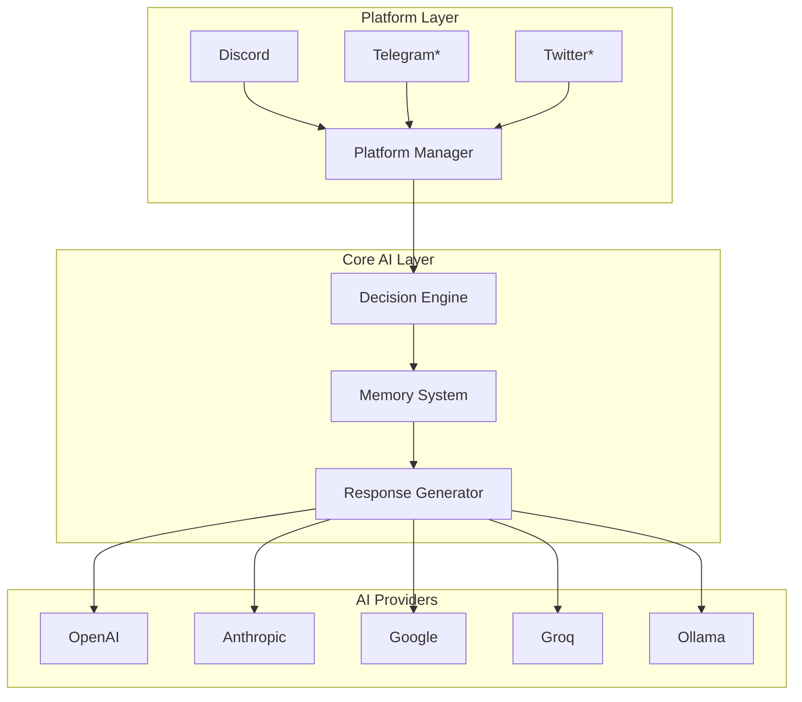
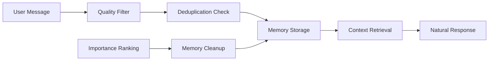
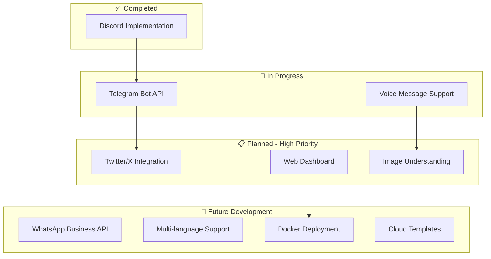

<div align="center">

# 🤖 CloneMe
### *Your AI Personality, Perfected*


> **Transform any AI into your perfect digital twin**  
> Advanced memory • Natural conversations • Multi-platform magic ✨

[](https://python.org)
[](https://discord.com)
[](https://openai.com)
[](CONTRIBUTING.md)

---

**🚀 [Quick Start](#quick-start) • 📖 [Documentation](#documentation) • 💬 [Join Discord](https://discord.gg/b7AXNvvx73) • 🤝 [Contribute](#roadmap--contributing)**

</div>

## 🎯 What Makes CloneMe Special?

Ever wished you could be everywhere at once? **CloneMe makes it possible.** Transform any AI into your perfect digital twin that learns, remembers, and responds just like you would - but smarter and always available.

<div align="center">
  
  <p><em>🎭 CloneMe in action - natural AI conversations with memory and personality</em></p>
</div>

### ✨ Why Developers Love CloneMe

<table>
<tr>
<td width="50%" valign="top">

#### 🧠 **Intelligent Memory**
Never repeat yourself again. CloneMe remembers names, preferences, and context across conversations.

#### 🎭 **Dynamic Personalities** 
Hot-swap between different AI personas instantly. From professional to casual, gaming to business.

#### ⚡ **Lightning Setup**
One command setup with our autonomous installer. No complex configuration headaches.

</td>
<td width="50%" valign="top">

#### 🌐 **Multi-Platform Ready**
Built for Discord today, designed for everywhere tomorrow. Extensible architecture that scales.

#### 🤖 **AI Provider Agnostic**
Works with OpenAI, Claude, Gemini, Groq, and local models. Your choice, your control.

#### 🛡️ **Security First**
Prompt injection protection, rate limiting, and local data storage. Your privacy matters.

</td>
</tr>
</table>

> 💡 **Pro Tip**: CloneMe isn't just another chatbot - it's your digital presence that learns and evolves with every conversation.

## 🌐 Platform & AI Support

<div align="center">

### Supported Platforms
| Platform | Status | Features |
|----------|--------|----------|
| 🎮 **Discord** | ✅ **Live** | Full implementation with memory & personalities |
| 📱 **Telegram** | 🚧 **Coming Soon** | Bot API integration in progress |
| 🐦 **Twitter/X** | 📋 **Planned** | Social media engagement ready |
| 💬 **WhatsApp** | 🔮 **Future** | Business API integration planned |

### AI Provider Ecosystem
| Provider | Models | Speed | Best For |
|----------|--------|-------|----------|
| 🤖 **OpenAI** | GPT-4, GPT-3.5-turbo | ⚡⚡⚡ | Balanced performance |
| 🧠 **Anthropic** | Claude-3-sonnet, Claude-3-haiku | ⚡⚡⚡ | Thoughtful responses |
| 🔍 **Google** | Gemini-pro, Gemini-1.5-pro | ⚡⚡⚡⚡ | Fast & efficient |
| 🚀 **Groq** | Llama, Mixtral | ⚡⚡⚡⚡⚡ | Ultra-fast inference |
| 🏠 **Ollama** | Local models | ⚡⚡ | Privacy & control |

</div>

## 🚀 Quick Start
*Get your AI clone running in under 5 minutes!*

### 📋 What You'll Need

<table>
<tr>
<td align="center" width="33%">
<strong>🐍 Python 3.11.6+</strong><br>
<em>The foundation</em>
</td>
<td align="center" width="33%">
<strong>🔑 AI API Key</strong><br>
<em>Your AI provider credentials</em>
</td>
<td align="center" width="33%">
<strong>🎮 Discord Token</strong><br>
<em>For Discord integration</em>
</td>
</tr>
</table>

### ⚡ Lightning Installation

**Step 1: Get the Code**
```bash
git clone https://github.com/vibheksoni/cloneme.git
cd cloneme
```

**Step 2: Magic Setup** ✨
```bash
python scripts/setup.py
```

> 🎯 **Our autonomous installer handles everything:**
> - ✅ Python compatibility check
> - ✅ Virtual environment creation  
> - ✅ Dependency installation
> - ✅ Directory structure setup
> - ✅ Configuration templates

### 🔧 Configuration Made Simple

**Step 3: Configure Your Clone**

<details>
<summary><strong>🔑 Essential Settings (.env file)</strong></summary>

```env
# 🎮 Platform Setup
PLATFORM=discord
DISCORD_SELF_TOKEN=your_discord_self_token_here

# 🤖 AI Brain Configuration  
AI_PROVIDER=openai                    # Choose your AI provider
AI_API_KEY=your_api_key_here         # Your API credentials
AI_MODEL=gpt-4                       # Model selection
AI_PROFILE=default_profile           # Personality profile

# 🎬 Optional Enhancements
GIPHY_API_KEY=your_giphy_api_key_here    # For GIF reactions
AZURE_OPENAI_ENDPOINT=your_azure_endpoint # For Azure OpenAI users
```

</details>

<details>
<summary><strong>🎭 Personality Customization (profiles/default_profile.json)</strong></summary>

```json
{
  "profiles": {
    "default": {
      "required": {
        "username": "YourUsername",
        "name": "Your Display Name"
      },
      "personality_traits": {
        "humor_style": "witty and sarcastic",
        "communication_style": "casual but intelligent",
        "interests": ["AI", "Gaming", "Technology"]
      },
      "custom_behaviors": {
        "emoji_usage": "moderate",
        "response_length": "concise",
        "technical_depth": "intermediate"
      }
    }
  }
}
```

</details>

### 🎉 Launch Your Clone

```bash
python main.py
```

> 🎊 **Success!** Your AI clone is now live and learning. Watch the magic happen in real-time!

## Documentation

| Document | Description |
|----------|-------------|
| [Settings Guide](settings/README.md) | Complete settings configuration with hot-reload |
| [Profile System](profiles/README.md) | Create dynamic AI personalities with flexible schemas |
| [Memory System](memories/README.md) | Intelligent memory with quality filtering and deduplication |
| [Message Flow](docs/MESSAGE_FLOW.md) | Detailed breakdown of message processing pipeline |

## Architecture

### System Design



### Core Components

- **Platform Manager**: Handles platform-specific message processing
- **Decision Engine**: Determines when and how to respond
- **Memory System**: Manages long-term conversation memory
- **Profile Manager**: Handles personality configuration and hot-reloading
- **AI Provider Interface**: Abstracts different AI service providers

### Extensibility

The system uses a `BasePlatform` abstraction for easy platform expansion:

```python
class NewPlatform(BasePlatform):
    def get_platform_name(self) -> str:
        return "new_platform"

    async def send_message(self, chat_id: str, content: str) -> bool:
        # Platform-specific implementation
        pass

    def convert_platform_message(self, platform_msg, chat, sender) -> Message:
        # Convert to generic Message object
        pass
```

## Memory System

The intelligent memory system focuses on quality over quantity:



**What it remembers:**
- Names, ages, locations, occupations
- Preferences, hobbies, relationships
- Important life events and goals

**What it filters out:**
- Temporary states and requests
- Meta-questions about the AI
- Low-quality or redundant information

**Features:**
- Quality-based filtering
- Automatic deduplication
- Importance-based cleanup
- Context-aware retrieval

## Profile System

Create sophisticated AI personalities with unlimited customization:

- **Hot-reload**: Changes apply instantly without restart
- **Flexible schema**: Required core fields plus unlimited custom fields
- **Multi-profile support**: Switch between different personalities
- **Validation**: Automatic schema checking

## Security Features

- **Prompt injection protection**: Advanced filtering of malicious inputs
- **Rate limiting**: Configurable participation controls
- **Local data storage**: No cloud sync, user-controlled data
- **Secure configuration**: Environment variable protection

## 💬 Community & Support

<div align="center">

### 🎮 Join Our Thriving Discord Community

[](https://discord.gg/b7AXNvvx73)

**🌟 Where CloneMe creators gather to build the future of AI personalities**

</div>

<table>
<tr>
<td width="50%" valign="top">

#### 🛠️ **Get Expert Help**
- Instant setup assistance from the community
- Troubleshooting with experienced users
- Best practices and optimization tips
- Live support from maintainers

#### 🎭 **Share Your Creations**
- Showcase your unique AI personalities
- Exchange custom profile configurations
- Get feedback on your implementations
- Inspire others with your use cases

</td>
<td width="50%" valign="top">

#### 🚀 **Shape the Future**
- Collaborate on new platform integrations
- Vote on upcoming features and priorities
- Beta test cutting-edge functionality
- Connect with potential collaborators

#### 📢 **Stay in the Loop**
- First to know about new releases
- Exclusive previews and behind-the-scenes
- Community challenges and events
- Direct line to the development team

</td>
</tr>
</table>

> 💡 **Pro Community Tip**: Our most active contributors often become platform maintainers and get early access to new features!

## Roadmap & Contributing

### Current Development Status



### 🌟 We're Actively Recruiting Talented Contributors!

**Ready to shape the future of AI personalities?** CloneMe is more than just a project - it's a movement. We're building the next generation of AI interaction, and we need passionate developers, designers, and AI enthusiasts to join our mission.

<div align="center">

**🎯 Whether you're a seasoned developer or just getting started, there's a perfect contribution waiting for you!**

[](https://github.com/vibheksoni/cloneme/issues)
[](https://github.com/vibheksoni/cloneme/labels/good%20first%20issue)

</div>

#### High-Priority Implementations Needed

<details>
<summary><strong>Platform Integrations</strong> - Help us reach more users</summary>

**Telegram Bot API** `Priority: High`
- Well-documented API with extensive bot capabilities
- Large user base seeking AI integration
- Framework already prepared, needs implementation
- **Skills needed**: Python, Telegram Bot API, async programming

**Twitter/X API Integration** `Priority: Medium`
- Social media expansion opportunity
- Real-time engagement possibilities
- API access considerations required
- **Skills needed**: Python, Twitter API v2, social media best practices

**WhatsApp Business API** `Priority: Medium`
- Business and personal communication platform
- Growing demand for AI assistants
- Complex API but high impact
- **Skills needed**: Python, WhatsApp Business API, webhook handling

**Slack Bot Integration** `Priority: Medium`
- Workplace productivity enhancement
- Team collaboration features
- Enterprise-friendly deployment
- **Skills needed**: Python, Slack API, workspace integrations

</details>

<details>
<summary><strong>AI & ML Enhancements</strong> - Advance the intelligence</summary>

**Voice Message Processing** `Priority: High`
- Audio input/output capabilities
- Speech-to-text and text-to-speech integration
- Natural voice personality matching
- **Skills needed**: Python, audio processing, OpenAI Whisper, TTS APIs

**Computer Vision Integration** `Priority: Medium`
- Image understanding and description
- Visual context awareness
- Meme and image reaction capabilities
- **Skills needed**: Python, OpenAI Vision API, image processing

**Emotion Detection & Response** `Priority: Medium`
- Sentiment analysis integration
- Mood-aware personality adaptation
- Emotional intelligence features
- **Skills needed**: Python, NLP, sentiment analysis, psychology understanding

**Multi-language Support** `Priority: Low`
- International user base expansion
- Language-specific personality traits
- Cultural context awareness
- **Skills needed**: Python, i18n, multiple languages, cultural knowledge

</details>

<details>
<summary><strong>Infrastructure & DevOps</strong> - Scale and optimize</summary>

**Web Dashboard** `Priority: High`
- GUI for configuration and monitoring
- Real-time conversation viewing
- Profile management interface
- **Skills needed**: React/Vue.js, Python FastAPI, WebSocket

**Performance Optimizations** `Priority: Medium`
- Response caching system
- Batch message processing
- Database integration options
- **Skills needed**: Python, Redis, PostgreSQL, performance optimization

**Docker & Cloud Deployment** `Priority: Medium`
- Containerized deployment options
- Cloud platform templates (AWS, GCP, Azure)
- Scalable architecture patterns
- **Skills needed**: Docker, Kubernetes, cloud platforms, DevOps

</details>

### How to Contribute

#### Getting Started

1. **Fork and Setup**
   ```bash
   # Fork the repository on GitHub, then clone your fork
   git clone https://github.com/yourusername/CloneMe.git
   cd CloneMe
   
   # Set up development environment
   python scripts/setup.py
   
   # Install development dependencies
   pip install -r requirements-dev.txt
   ```

2. **Development Workflow**
   ```bash
   # Create feature branch
   git checkout -b feature/platform-telegram
   
   # Make your changes and test
   python -m pytest tests/
   
   # Run the application
   python main.py
   ```

3. **Contribution Guidelines**
   - Follow existing architecture patterns and code style
   - Use `BasePlatform` abstraction for new platform implementations
   - Maintain backward compatibility with existing configurations
   - Include comprehensive documentation and tests
   - Update relevant README sections for new features

#### 🏆 Contributor Recognition & Rewards

<div align="center">

**We believe in recognizing and rewarding our amazing contributors!**

</div>

<table>
<tr>
<td align="center" width="25%">
<strong>🎖️ Code Attribution</strong><br>
<em>Permanent recognition in our contributors hall of fame</em>
</td>
<td align="center" width="25%">
<strong>👑 Maintainer Status</strong><br>
<em>Lead maintainer role for your platform implementations</em>
</td>
<td align="center" width="25%">
<strong>🚀 Early Access</strong><br>
<em>Preview and test new features before public release</em>
</td>
<td align="center" width="25%">
<strong>🌟 Community Fame</strong><br>
<em>Featured in Discord, release notes, and social media</em>
</td>
</tr>
</table>

> 🎉 **Special Perks**: Top contributors get exclusive CloneMe swag, direct access to the core team, and opportunities to speak at AI conferences!

## Troubleshooting

### Common Issues

<details>
<summary><strong>ModuleNotFoundError during installation</strong></summary>

**Problem**: Python cannot find required modules after installation

**Root Cause**: Virtual environment not activated or dependencies not properly installed

**Solution Steps**:
1. Verify virtual environment activation:
   ```bash
   # Windows
   venv\Scripts\activate
   
   # macOS/Linux
   source venv/bin/activate
   ```

2. Reinstall dependencies:
   ```bash
   pip install --upgrade pip
   pip install -r requirements.txt
   ```

3. Verify Python version compatibility:
   ```bash
   python --version  # Should be 3.11.6+
   ```

</details>

<details>
<summary><strong>Authentication and token errors</strong></summary>

**Problem**: Invalid token errors or authentication failures

**Common Error Messages**:
- `discord.errors.LoginFailure: Improper token has been passed`
- `openai.error.AuthenticationError: Invalid API key`

**Solution Steps**:
1. Verify token format in `.env` file (no extra spaces or quotes)
2. Check token permissions and validity
3. For Discord: Ensure account doesn't have unusual restrictions
4. For AI providers: Verify API key is active and has sufficient credits
5. Test tokens independently before running CloneMe

</details>

<details>
<summary><strong>Rate limiting and API quota issues</strong></summary>

**Problem**: Frequent rate limiting or API quota exceeded

**Symptoms**:
- "Rate limited. Retrying in X seconds..." messages
- Delayed or missing responses
- API quota exceeded errors

**Solution Steps**:
1. Adjust participation controls in `settings.json`:
   ```json
   {
     "participation_control": {
       "threshold_percentage": 15,
       "time_window_minutes": 20
     }
   }
   ```

2. Monitor API usage in your provider dashboard
3. Consider upgrading API plan if needed
4. Implement longer delays between messages

</details>

<details>
<summary><strong>Profile and configuration issues</strong></summary>

**Problem**: AI personality not reflecting configured settings

**Common Issues**:
- Profile changes not taking effect
- JSON syntax errors
- Missing required fields

**Solution Steps**:
1. Validate JSON syntax using online JSON validator
2. Check profile name matches `.env` AI_PROFILE setting
3. Verify all required fields are present
4. Test hot-reload by saving profile file
5. Check logs for profile loading errors

</details>

<details>
<summary><strong>Memory system not functioning</strong></summary>

**Problem**: AI doesn't remember previous conversations

**Possible Causes**:
- Memory directory permissions
- Quality filtering too aggressive
- Memory file corruption

**Solution Steps**:
1. Verify `memories/` directory exists and is writable
2. Check memory settings in `settings.json`
3. Review memory quality thresholds
4. Clear corrupted memory files if necessary
5. Monitor logs for memory-related errors

</details>

### Getting Help

<div align="center">

| Support Type | Link |
|--------------|------|
| 🐛 **Bug Reports** | [Create Issue](https://github.com/vibheksoni/cloneme/issues/new?template=bug_report.md) |
| 💡 **Feature Requests** | [Request Feature](https://github.com/vibheksoni/cloneme/issues/new?template=feature_request.md) |
| 💬 **Community Support** | [Join Discord](https://discord.gg/b7AXNvvx73) |
| 📖 **Documentation** | [View Docs](https://github.com/vibheksoni/cloneme/tree/main/docs) |

</div>

## License

This project is licensed under the MIT License with attribution requirements - see the [LICENSE](LICENSE) file for details.

**Attribution Requirement**: Any use, modification, or distribution must include proper attribution to the original CloneMe project and link to https://github.com/vibheksoni/cloneme 