# CloneMe Message Processing Flow

> **🔄 Complete breakdown of how messages flow through the CloneMe system from input to response**

## Overview

This document details the complete message processing pipeline, showing how CloneMe transforms incoming platform messages into intelligent AI responses through multiple stages of analysis, decision-making, and generation.

## System Architecture


## Detailed Message Flow

### Phase 1: Message Ingestion


**Key Operations:**
1. **Platform Event**: Discord `on_message` event triggered
2. **Self-Check**: Skip if message is from the AI itself
3. **Bot Filter**: Skip if message is from another bot
4. **Active Chat Check**: Verify chat is active or should always respond
5. **Message Conversion**: Convert platform-specific message to generic `Message` object
6. **Context Collection**: Gather recent messages for conversation context

### Phase 2: Security & Classification


**Security Screening Process:**
```python
# Security threat detection patterns
security_threats = [
    "prompt injection attempts",
    "role manipulation",
    "system override attempts",
    "malicious instructions"
]
```

**Content Classification:**
- **Intent Detection**: Question, statement, greeting, request
- **Information Value**: High, medium, low value content
- **Conversation Flow**: Standalone, response, continuation

### Phase 3: Decision Engine Analysis


**Decision Factors:**

1. **Participation Control**
   ```python
   # Check if AI is over-participating
   participation_rate = ai_messages / total_messages
   if participation_rate > threshold:
       reduce_response_likelihood()
   ```

2. **Context Relevance**
   ```python
   # Analyze conversation context
   context_factors = {
       "direct_mention": True/False,
       "question_directed": True/False,
       "conversation_continuation": True/False,
       "high_value_information": True/False
   }
   ```

3. **Profile Settings**
   ```python
   # Check profile-specific rules
   if profile.should_reply_to_off_topic() and is_flagged:
       generate_off_topic_response()
   ```

### Phase 4: Memory Operations


**Memory Quality Filters:**
```python
# Information persistence test
def is_persistent_info(content):
    return not any(pattern in content.lower() for pattern in [
        "weather", "remember where", "located ?", 
        "tell me", "can you", "i'm tired", "i'm hungry"
    ])

# Personal relevance test  
def is_personal_info(content):
    return any(pattern in content.lower() for pattern in [
        "my name is", "i'm from", "i work as",
        "i love", "i hate", "i have"
    ])
```

### Phase 5: Response Generation


**Expert Prompt Construction:**
```python
def construct_expert_prompt():
    return f"""
    ## YOUR CHARACTER PROFILE
    {profile.format_for_llm()}
    
    ## CONVERSATION CONTEXT
    {format_context_messages(context)}
    
    ## ENHANCED USER CONTEXT
    {format_relevant_memories(memories)}
    
    ## CURRENT MESSAGE
    {target_message.content}
    
    ## RESPONSE INSTRUCTIONS
    Generate a natural response as your character...
    """
```

### Phase 6: AI Provider Routing


**Provider Selection Logic:**
```python
# From environment variables
AI_PROVIDER = os.getenv("AI_PROVIDER")  # openai, claude, groq, etc.
AI_MODEL = os.getenv("AI_MODEL")        # gpt-4, claude-3-sonnet, etc.
AI_API_KEY = os.getenv("AI_API_KEY")    # Provider-specific API key

# Router creates appropriate LLM instance
llm = create_llm(provider=AI_PROVIDER, model=AI_MODEL, api_key=AI_API_KEY)
```

### Phase 7: Response Delivery


**Typing Simulation:**
```python
# Realistic typing simulation
typing_speed = random.uniform(3.5, 5.0)  # chars per second
thinking_time = random.uniform(0.5, 2.0)  # seconds
message_length = len(response)
typing_duration = message_length / typing_speed

await platform.start_typing(chat_id)
await asyncio.sleep(thinking_time + typing_duration)
await platform.send_message(chat_id, response)
await platform.stop_typing(chat_id)
```

## Performance Optimizations

### Caching System

```python
# Decision caching to reduce AI calls
cache_ttl = {
    "security": 3600,        # 1 hour
    "classification": 1800,  # 30 minutes  
    "information_value": 600 # 10 minutes
}
```

### Context Optimization

```python
# Limit context to prevent token overflow
max_context_messages = 10
context_preview_length = 150
show_full_recent_messages = 3
```

### Memory Efficiency

```python
# Smart memory cleanup
max_memories = 50
cleanup_based_on_importance_and_recency = True
```

## Error Handling

### Graceful Degradation


### Error Recovery Strategies

1. **AI Provider Failures**
   ```python
   try:
       response = primary_llm.invoke(messages)
   except Exception:
       response = fallback_llm.invoke(messages)
   ```

2. **Memory System Failures**
   ```python
   try:
       save_memory(memory_data)
   except Exception:
       log_error("Memory save failed, continuing without memory")
   ```

3. **Platform Delivery Failures**
   ```python
   try:
       await platform.send_message(chat_id, response)
   except Exception:
       await retry_with_exponential_backoff()
   ```

## Monitoring & Logging

### Real-Time Flow Visualization

```mermaid
graph LR
    A[📥 Message In] --> B[🔍 Analysis]
    B --> C[🧠 Decision]
    C --> D[💭 Generation]
    D --> E[📤 Response Out]

    F[⏱️ Timing] --> G[📊 Metrics]
    H[🚨 Errors] --> G
    I[💾 Memory] --> G
```



### Key Metrics Tracked

```python
# Performance metrics
response_time = end_time - start_time
ai_provider_calls = count_llm_invocations()
memory_operations = count_memory_saves()
error_rate = errors / total_messages

# Decision metrics
reply_rate = replies_sent / messages_processed
flagged_content_rate = flagged_messages / total_messages
participation_rate = ai_messages / total_messages
```

### Log Levels

```python
# Debug: Detailed flow information
logger.debug("🔄 Processing USER message from user...")

# Info: Important state changes
logger.info("✅ Response sent successfully")

# Warning: Recoverable issues
logger.warning("⚠️ AI provider timeout, retrying...")

# Error: Serious problems
logger.error("❌ Critical error in message processing")
```

## Configuration Impact

### Settings That Affect Flow

```json
{
  "participation_control": {
    "threshold_percentage": 30,  // Affects reply decisions
    "time_window_minutes": 10    // Affects participation calculation
  },
  "ai_behavior": {
    "typing_simulation": {
      "enabled": true,           // Affects delivery timing
      "base_speed_range": [3.5, 5.0]  // Affects typing speed
    },
    "context_engine": {
      "max_context_messages": 10  // Affects context size
    }
  }
}
```

### Profile Impact

```python
# Profile affects multiple stages
if profile.should_reply_to_off_topic():
    handle_flagged_content()

response_style = profile.get_response_style(context_type)
personality_context = profile.format_for_llm()
```

---

**📚 Related Documentation:**
- [Settings Configuration](../settings/README.md)
- [Profile System](../profiles/README.md)
- [Memory System](../memories/README.md)
- [Main Documentation](../README.md)
