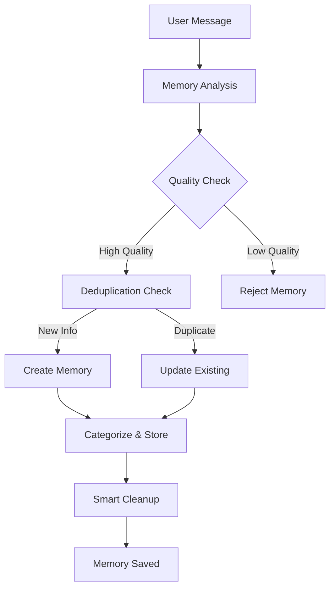
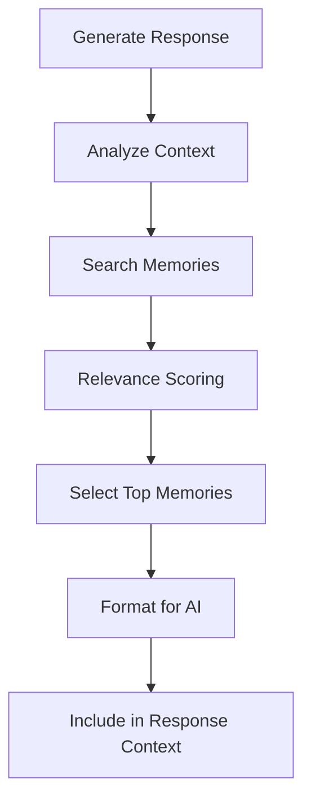
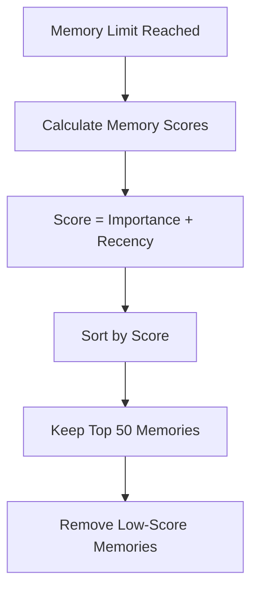

# CloneMe Memory System

> **🧠 Intelligent long-term memory with quality filtering, deduplication, and smart cleanup**

## Overview

CloneMe's memory system creates persistent, meaningful memories of user interactions:
- **🎯 Quality-focused**: Saves only valuable long-term information
- **🚫 Deduplication**: Prevents redundant memory entries
- **🧹 Smart cleanup**: Importance-based memory management
- **📊 Categorization**: Organized memory storage by type
- **🔍 Retrieval**: Context-aware memory recall for responses

## File Structure

```
memories/
├── discord_1234567890.json    # User-specific memory files
├── telegram_9876543210.json   # Platform-specific memories
└── README.md                  # This documentation
```

## How It Works

### Memory Creation Workflow



### Memory Retrieval Process



## Memory Quality System

### What Gets Saved ✅

**High-Value Information:**
- **Core Identity**: Names, age, gender, pronouns
- **Stable Location**: Home location, origin country/city
- **Professional**: Career, job, education, skills
- **Relationships**: Family structure, relationship status, pets
- **Persistent Preferences**: Food likes/dislikes, hobbies, interests
- **Health/Dietary**: Allergies, dietary restrictions, health conditions
- **Goals/Plans**: Long-term goals, important upcoming events

**Example Messages That Create Memories:**
```
✅ "My name is Sarah" → name: Sarah
✅ "I'm 28 years old" → age: 28
✅ "I work as a software engineer" → profession: software engineer
✅ "I live in Seattle" → home_location: Seattle
✅ "I'm allergic to peanuts" → allergy: peanuts
✅ "I have two kids" → family: 2 children
```

### What Gets Rejected ❌

**Low-Value Data:**
- **Temporary States**: "I'm tired", "I'm hungry", "I'm bored"
- **Questions/Requests**: "Where am I located?", "What's the weather?"
- **Meta-conversation**: "Do you remember...", "Can you tell me..."
- **Simple Reactions**: "ok", "thanks", "cool", "nice", "lol"
- **Weather/Current Events**: "It's raining", "Traffic is bad"

**Example Messages That Get Rejected:**
```
❌ "nothing just chilling in china bro" → casual activity, no new info
❌ "Yo do you remember where im located ?" → question about existing info
❌ "Can you tell me the weather today?" → weather request
❌ "ok" → simple acknowledgment
❌ "I'm tired" → temporary state
```

## Memory Structure

### Memory Entry Format

```json
{
  "timestamp": "2025-06-12T04:41:50.325360+00:00",
  "category": "personal_info",
  "data": {
    "name": "Aiden Shen",
    "location": "China"
  },
  "importance": "high",
  "source": "User message: My name is Aiden and I live in China"
}
```

### Memory Categories

| Category | Description | Examples |
|----------|-------------|----------|
| `personal_info` | Core identity and basic info | Name, age, location, occupation |
| `preferences` | Likes, dislikes, interests | Food preferences, hobbies, music |
| `relationships` | Family, friends, romantic | "I have a sister", "My dog Max" |
| `professional` | Work, education, skills | Job title, education, expertise |
| `health` | Medical, dietary, physical | Allergies, diet restrictions |
| `goals` | Plans, aspirations, events | "Learning Spanish", "Getting married" |

### Importance Levels

| Level | Description | Retention | Examples |
|-------|-------------|-----------|----------|
| `high` | Core identity, permanent traits | Highest priority | Name, age, profession, allergies |
| `medium` | Preferences, relationships | Medium priority | Hobbies, family info, goals |
| `low` | Temporary or less critical | Lowest priority | Casual mentions, minor preferences |

## Deduplication System

### Duplicate Detection

The system prevents redundant memories through multiple checks:

1. **Exact Match Detection**
   ```json
   Existing: {"location": "China"}
   New: {"location": "China"}
   Result: ❌ Rejected as duplicate
   ```

2. **Similar Value Detection**
   ```json
   Existing: {"name": "John Smith"}
   New: {"name": "john smith"}
   Result: ❌ Rejected as duplicate (case-insensitive)
   ```

3. **Category Overlap**
   ```json
   Existing: {"current_location": "Tokyo"}
   New: {"location": "Tokyo"}
   Result: ❌ Rejected as duplicate (same location, different key)
   ```

### Meta-Information Filtering

The system automatically rejects meta-information that doesn't represent actual user data:

```mermaid
graph TD
    A[New Memory Candidate] --> B{Contains Meta-Info?}
    B -->|Yes| C[Check Patterns]
    C --> D{Matches Meta Pattern?}
    D -->|Yes| E[❌ Reject Memory]
    D -->|No| F[✅ Continue Processing]
    B -->|No| F

    G[Meta Patterns] --> H["current_location_query"]
    G --> I["location_request"]
    G --> J["weather_request"]
    G --> K["asking", "wondering"]
```

### Memory Consolidation

When similar information is found, the system consolidates instead of duplicating:

```json
// Before
{
  "data": {"location": "China"},
  "timestamp": "2025-06-10T04:41:50Z",
  "importance": "medium"
}

// New information: "I'm from China originally"
// After consolidation
{
  "data": {"location": "China", "origin": "China"},
  "timestamp": "2025-06-12T04:41:50Z",  // Updated to latest
  "importance": "high"  // Upgraded importance
}
```

## Smart Cleanup System

### Cleanup Algorithm

When memory limit is reached (50 memories), the system uses intelligent cleanup:



### Scoring Formula

```
Memory Score = Importance Weight + Recency Score

Importance Weights:
- high: 3 points
- medium: 2 points  
- low: 1 point

Recency Score:
- Recent memories: Up to 1 additional point
- Older memories: Gradually decreasing score
- 1 year old: 0 additional points
```

### Example Cleanup Decision

```
Memory A: high importance, 1 day old → Score: 3 + 0.99 = 3.99
Memory B: medium importance, 1 week old → Score: 2 + 0.98 = 2.98
Memory C: low importance, 1 month old → Score: 1 + 0.92 = 1.92

Result: Memory C gets removed first
```

## Memory Retrieval

### Context-Aware Retrieval

When generating responses, the system:

1. **Analyzes current conversation** for relevant topics
2. **Searches memories** for matching content
3. **Scores relevance** based on context similarity
4. **Selects top memories** for inclusion
5. **Formats for AI** with clear context markers

### Retrieval Example

```
User: "What's my favorite food?"

Memory Search Results:
✅ {"food_preference": "Italian cuisine"} - High relevance
✅ {"allergy": "peanuts"} - Medium relevance  
❌ {"location": "China"} - Low relevance

AI Context: "User prefers Italian cuisine and is allergic to peanuts"
```

## API Reference

### Memory Operations

```python
# Check if memory should be saved
should_save, reasoning = decision.should_save_memory(
    target_message=message,
    person=sender,
    platform_prefix="discord"
)

# Retrieve relevant memories
memories, reasoning = decision.retrieve_relevant_memories(
    target_message=message,
    person=sender,
    platform_prefix="discord"
)
```

### Memory File Operations

```python
# Memory files are automatically managed
# Location: memories/{platform}_{user_id}.json

# Example file: memories/discord_1234567890.json
{
  "user_id": "1234567890",
  "platform": "discord", 
  "created_at": "2025-06-10T04:41:50.325360+00:00",
  "last_updated": "2025-06-12T04:43:41.924782+00:00",
  "memories": [
    // Array of memory entries
  ]
}
```

## Memory Analytics

### Quality Metrics

The system tracks memory quality through:
- **Acceptance Rate**: % of analyzed messages that create memories
- **Deduplication Rate**: % of potential memories rejected as duplicates
- **Cleanup Frequency**: How often memory limits are reached
- **Retrieval Relevance**: How often retrieved memories are used in responses

### Performance Monitoring

```bash
# Check memory system performance in logs
grep "Memory Analysis" logs/*/platform_manager.log
grep "💾" logs/*/platform_manager.log

# Example log entries:
💾 Memory Analysis: Saved new info
🧠 Memory Reasoning: High-value personal information detected
🔄 Updated existing memory for user 1234567890: personal_info
🚫 Rejected low-quality memory: weather request
```

## Troubleshooting

### Common Issues

1. **Too many memories being saved**
   ```bash
   # Check quality filtering in logs
   grep "Rejected" logs/*/platform_manager.log
   
   # Adjust quality thresholds if needed
   ```

2. **Important information not being saved**
   ```bash
   # Check memory analysis reasoning
   grep "Memory Reasoning" logs/*/platform_manager.log
   
   # Verify information meets quality criteria
   ```

3. **Memory file corruption**
   ```bash
   # Validate JSON format
   python -m json.tool memories/discord_1234567890.json
   
   # Check for backup files
   ls memories/*.backup
   ```

### Best Practices

- **Monitor logs** for memory system performance
- **Review memory files** periodically for accuracy
- **Adjust quality settings** based on your needs
- **Backup important memory files** before major changes

---

**📚 Related Documentation:**
- [Settings Configuration](../settings/README.md)
- [Profile System](../profiles/README.md)
- [Message Flow](../docs/MESSAGE_FLOW.md)
- [Main Documentation](../README.md)
